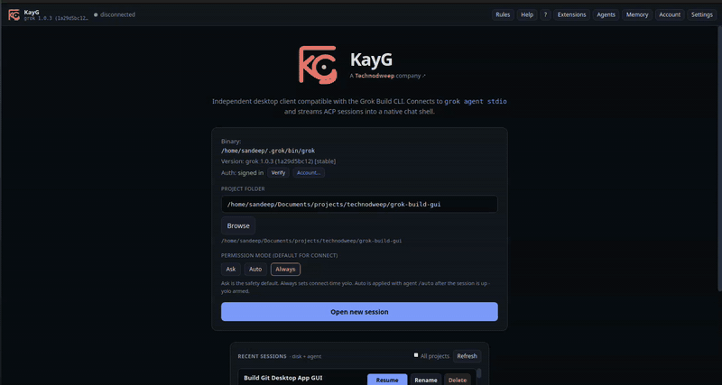

# KayG — Open-source Grok Build GUI for Desktop

<p align="center">
  
</p>

**KayG is an independent, open-source Grok Build GUI and cross-platform Grok
desktop client from [Technodweep](https://www.technodweep.com/).** It gives the
[Grok Build CLI](https://docs.x.ai/build/overview) a native visual interface on
Linux, macOS, and Windows, powered by **Tauri 2**, React, Rust, and the
[Agent Client Protocol (ACP)](https://agentclientprotocol.com).

[](LICENSE)
[](docs/packaging.md)
[](https://www.technodweep.com/)

> [!IMPORTANT]
> KayG is an independent community project. It is not affiliated with,
> endorsed by, or sponsored by xAI. Grok and Grok Build are trademarks of xAI.

## Grok Build, with a native desktop interface

KayG is a visual shell for the Grok Build coding agent. The Grok CLI remains
the brain and continues to own authentication, tools, MCP servers, sessions,
and model access. KayG launches `grok agent stdio` and communicates with it over
ACP, adding a desktop workflow without reimplementing the agent.

Unlike a wrapper around `grok.com`, KayG is designed specifically as a **GUI
for the Grok Build CLI** and its coding-agent workflows.

```text
KayG desktop app  <── Agent Client Protocol ──>  Grok Build CLI  <──>  xAI
```

## See KayG in action

<p align="center">
  <a href="assets/demo/kayg-demo.mp4">
    
  </a>
</p>

Click the preview to [watch the full-quality video](assets/demo/kayg-demo.mp4).

## Download

Release tags beginning with `v` automatically build KayG packages for Linux,
macOS, and Windows and publish them to
[GitHub Releases](https://github.com/technodweep/grok-build-gui/releases).
If a public release is not available yet, follow the source-build instructions
below.

| Platform | Packages |
|---|---|
| Linux | `.deb`, `.rpm`, `.AppImage` |
| macOS | `.app`, `.dmg` |
| Windows | NSIS `.exe`, `.msi` |

## Features

- Chat with streaming replies, thinking, tool cards, plans, and elicitation
- Permissions (Ask / Auto / Always), plan mode, compact / rewind / fork
- Sessions: resume / rename / delete; multi-agent dashboard
- Composer: `/` commands, `@` files, image attach, queue, fuzzy history
- Hubs: Extensions (MCP/skills/plugins), Agents, Tasks, Memory, Account, Rules
- Agent terminals (live panel + tool-card embed), workflows / loops / goals
- Memory (`/remember`, browse, flush/dream) and media (`/imagine` gallery)
- Project `AGENTS.md` editor and custom model endpoints in `config.toml`
- Context and usage, find-in-scrollback, raw Markdown, and themes
- Login, logout, doctor, and sandbox controls without returning to the TUI

## Requirements

### Grok Build runtime

- **Grok CLI 0.2.x or newer** on `PATH` (or at `~/.grok/bin/grok`)
- An authenticated Grok session or an `XAI_API_KEY`

```bash
curl -fsSL https://x.ai/cli/install.sh | bash
grok --version
```

### Source-build toolchain

- Rust stable (`rustup`)
- Node.js **22 or newer**
- `pnpm`

Linux builds also require WebKitGTK, GTK, and the standard Tauri system
dependencies listed under [Linux development dependencies](#linux-development-dependencies).

## Frequently asked questions

### Is KayG an official xAI application?

No. KayG is an independent Technodweep community project. It is compatible
with the Grok Build CLI but is not affiliated with, endorsed by, or sponsored
by xAI.

### Is KayG a wrapper around the Grok website?

No. KayG connects to `grok agent stdio` over ACP and presents the Grok Build
coding agent as a native desktop application.

### Does KayG include the Grok CLI or an xAI subscription?

No. Install and authenticate the Grok CLI separately. Any Grok account,
subscription, API access, and usage charges remain between you and xAI.

### Which operating systems does KayG support?

KayG is designed for Linux, macOS, and Windows. The release workflow builds
native packages for all three platforms.

### Can KayG use an xAI API key?

Yes. Set `XAI_API_KEY`, or authenticate by running `grok` in a terminal before
opening KayG.

## Build from source

```bash
pnpm install --dir apps/desktop
pnpm dev
```

`pnpm dev` uses `./scripts/dev.sh`, which configures the GTK/WebKit environment
when needed. To start Tauri without the helper, use `pnpm dev:raw`.

### Linux development dependencies

```bash
sudo apt update
sudo apt install -y \
  libwebkit2gtk-4.1-dev libgtk-3-dev librsvg2-dev \
  patchelf libayatana-appindicator3-dev build-essential \
  curl wget file libssl-dev libxdo-dev pkg-config
```

If system development packages are unavailable, `./scripts/dev.sh` can use
dependencies under `~/.local/tauri-deps`.

**Blank WebKit window on Linux:** KayG sets
`WEBKIT_DISABLE_DMABUF_RENDERER=1` by default. The Vite development URL already
uses `127.0.0.1` for better WebKit compatibility.

### Local CI

```bash
./scripts/ci-local.sh
# or
pnpm ci
```

## Package

```bash
# Linux (from the repository root)
./scripts/build-linux.sh
# target/release/bundle/{deb,appimage,rpm}/

# macOS
cd apps/desktop && pnpm tauri build --bundles app,dmg

# Windows
cd apps/desktop && pnpm tauri build --bundles nsis,msi
```

See the [packaging guide](docs/packaging.md) for platform-specific details.

## Documentation

- **[Changelog](CHANGELOG.md)** — v0.1.0 notes
- **[Architecture](docs/architecture.md)** — desktop and ACP design
- **[Shipped ACP surface checklist](docs/acp-surface.md)** — supported protocol surface
- **[Full feature parity plan](docs/full-parity-plan.md)** — phases A–I inventory
- **[Multi-repository workspaces plan](docs/multi-repo-workspaces-plan.md)** — workspace dashboard and delivery phases
- **[Packaging](docs/packaging.md)** — Linux, macOS, and Windows builds

## Repository layout

```text
apps/desktop/          Tauri app (React UI + Rust backend)
docs/                  Architecture, ACP checklist, and packaging
scripts/               Local CI and Linux build helpers
.github/workflows/     CI and cross-platform releases
```

## Configuration

| Environment variable | Meaning |
|---|---|
| `GROK_HOME` | Override the Grok config/session root (default `~/.grok`) |
| `GROK_BINARY` | Path to the `grok` binary |
| `XAI_API_KEY` | API-key authentication, optional when browser auth exists |
| `RUST_LOG` | Tracing filter, for example `info,kayg_lib=debug` |

GUI settings such as theme, binary override, and last project live in
`~/.grok/gui/settings.json`.

## Safety

- The default permission mode is **Ask**.
- Client filesystem handlers are sandboxed to the session project directory.
- Enabling “Always approve tools” explicitly opts new and resumed connections
  into automatic tool approval.

## Contributing

Issues and pull requests are welcome. Please describe the user problem, keep
changes focused, and run `pnpm ci` before submitting a pull request.

## Built by Technodweep

KayG is created and maintained by
[Technodweep](https://www.technodweep.com/). Visit our website to explore our
other products and engineering work.

## License and trademarks

KayG source code and documentation are licensed under the
[Apache License 2.0](LICENSE). See [NOTICE](NOTICE) for attribution.

The KayG name, logo, and application icons are Technodweep brand assets and
are covered by the [KayG trademark and brand policy](TRADEMARKS.md), not by the
Apache License 2.0. Grok and Grok Build are trademarks of xAI.
