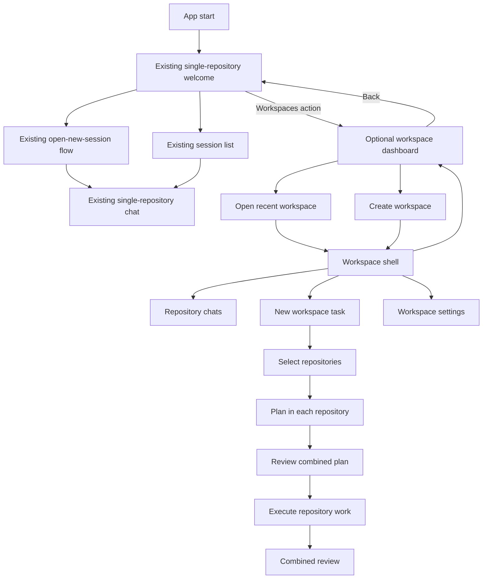
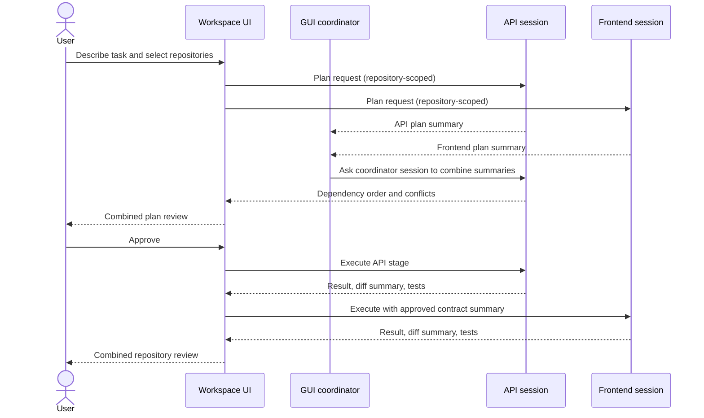
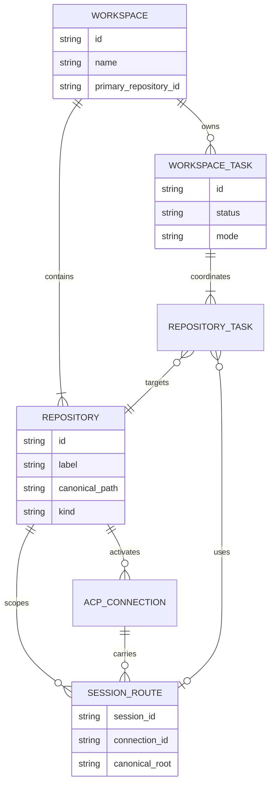
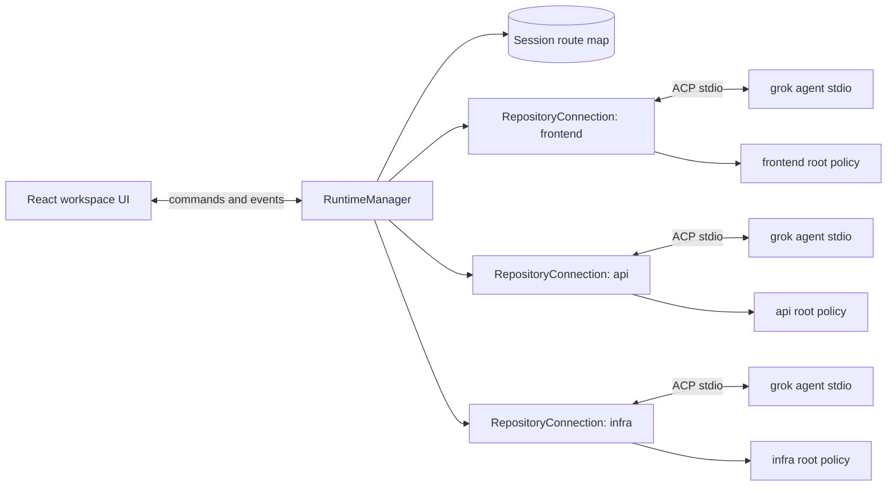
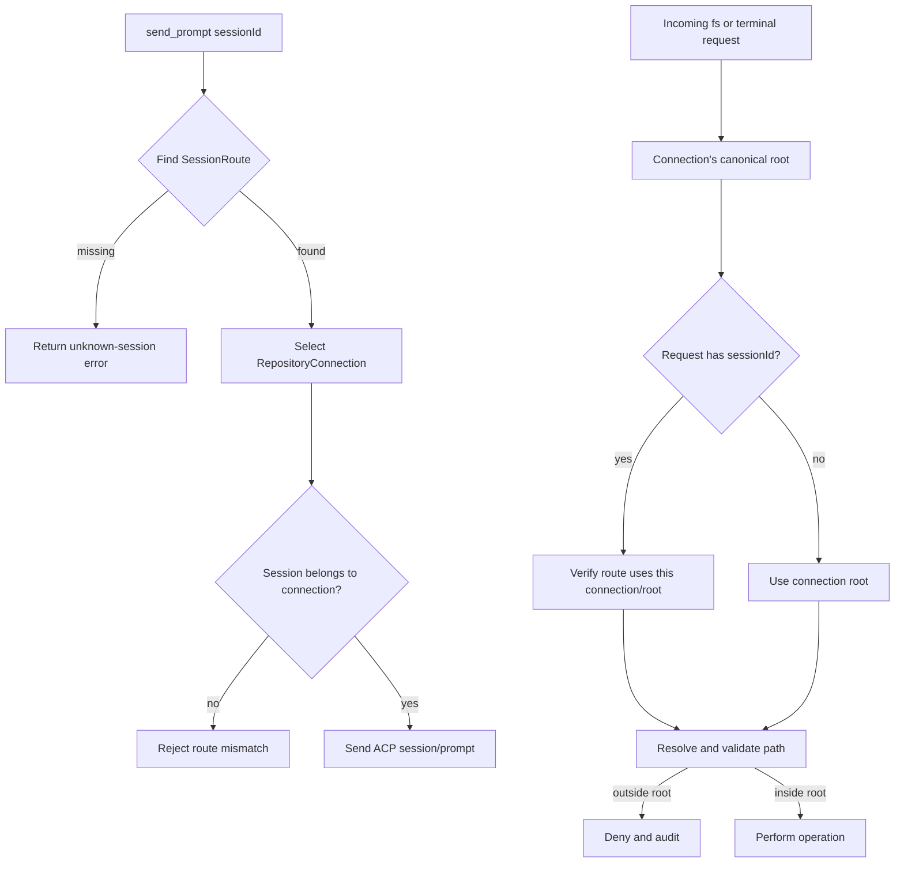
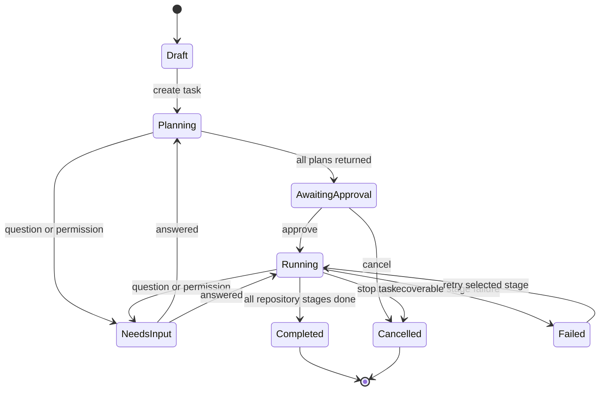

# Multi-repository workspaces — product and implementation plan

**Status:** Proposed  
**Audience:** Product, design, frontend, and Rust/ACP maintainers  
**Goal:** Add an optional multi-repository workspace dashboard without changing the existing single-repository welcome, connection, chat, or session-list experience.

## 1. Executive summary

Introduce a first-class **workspace** containing several repository roots as an additional application mode. The current welcome screen remains the default startup experience: users can select one project folder and open a session exactly as they do today. A new **Workspaces** action opens a separate workspace dashboard for users who need multi-repository coordination.

Inside workspace mode, a normal chat remains scoped to exactly one repository. A **workspace task** is an explicit orchestration flow that plans and executes related work through repository-scoped sessions, then presents one combined result. No workspace rail, workspace terminology, or setup step is added to the ordinary single-repository chat.

The recommended runtime model is:

- an optional workspace dashboard alongside the existing single-repository flow;
- one ACP connection per repository while that repository is active;
- many sessions may share a repository connection;
- every session is permanently bound to one repository root;
- a thin GUI coordinator moves plans and summaries between sessions for cross-repository work;
- filesystem, attachment, terminal, trust, diff, and permission operations are resolved through the session-to-repository binding.

This preserves the existing architectural rule that the CLI agent owns agent behavior while the GUI owns navigation, routing, presentation, and safety.

### Product decision: additive feature

This plan intentionally treats multi-repository workspaces as an optional advanced feature:

- the app still starts on the current `Welcome` view;
- the current project-folder field and **Open new session** button remain the primary call to action;
- no implicit workspace is created for a single repository;
- ordinary chats do not show a repository rail;
- workspace definitions, settings, and navigation are loaded only after the user enters the workspace dashboard;
- users can return to the existing single-repository home at any time.

## 2. Why this needs an explicit feature

Opening a common parent directory already gives a single session visibility into several nested repositories, but it has important limitations:

- the filesystem boundary becomes the whole parent directory;
- unrelated sibling directories may become visible;
- project rules, trust, skills, and memory have an ambiguous scope;
- Git status and changes are harder to attribute;
- there is no per-repository session or permission identity;
- a failure in one repository is difficult to isolate from the rest of the task.

The current application is close to supporting independent repositories because sessions already carry a `cwd` and the dashboard tracks multiple live sessions. However, the frontend stores one `projectCwd`, settings remember one last project, and ACP filesystem/terminal handlers capture the connection's original directory. A different `cwd` must not be exposed in the UI until request routing and sandbox selection are session-aware.

## 3. Terminology

| Term | Meaning |
|------|---------|
| **Workspace** | A named GUI container holding two or more repositories and workspace-level preferences. It is not necessarily a filesystem directory. |
| **Repository** | One canonical filesystem root, normally containing `.git`. Non-Git folders may be supported but are labelled as folders. |
| **Primary repository** | The default target for new chats and workspace-level configuration. |
| **Repository session** | A normal ACP session bound to one repository and one `cwd`. |
| **Workspace task** | One user request deliberately targeting two or more repositories. |
| **Coordinator** | GUI-managed orchestration that gathers repository plans/results and sends summaries through ACP sessions. It does not edit files itself. |
| **Session route** | The backend mapping from a session ID to its connection, workspace, repository, and allowed root. |

## 4. Product principles

1. **Add, do not replace.** The current welcome screen, project-folder picker, permission controls, “Open new session” action, session list, and single-repository chat remain the default path.
2. **Workspace mode is opt-in.** It opens through a separate **Workspaces** action and has its own dashboard and shell.
3. **One chat has one repository boundary.** In workspace mode, the repository is always visible beside the session title.
4. **Cross-repository work is explicit.** A user selects “Workspace task” and chooses target repositories.
5. **Repositories remain independent Git units.** Status, diffs, tests, commits, branches, and pull requests are presented per repository.
6. **No silent widening of access.** Adding a repository does not give existing sessions access to it.
7. **The GUI coordinates; the agent reasons and acts.** Do not create a second tool or planning engine in the desktop host.
8. **Feature-detect ACP behavior.** A repository remains usable even if optional coordination features are unavailable.

## 5. Scope

### In scope

- create, open, rename, and delete GUI workspace definitions;
- add, remove, reorder, and label repository roots;
- open and resume repository-scoped sessions;
- keep sessions from several repositories live together;
- search and attach files across repositories with unambiguous labels;
- start a task against selected repositories;
- plan, approve, execute, monitor, cancel, and review that task;
- show combined progress with repository-specific diffs and test results;
- enforce repository-aware filesystem and terminal policies;
- preserve the current single-project settings and sessions independently from workspace metadata.

### Not in the first release

- treating multiple repositories as one Git repository;
- atomic commits or rollback across repositories;
- automatic pushes or pull requests;
- cloning repositories from a remote URL;
- dependency graph discovery from every package ecosystem;
- moving files directly between repositories without explicit approval;
- simultaneous editing of the same repository by several write-enabled sessions;
- replacing or redesigning the current single-repository welcome and chat UI.

## 6. Information architecture



The existing welcome and chat routes do not render workspace components. The repository rail is added only inside `WorkspaceShell`, where it surrounds the reused toolbar, chat, and optional right-side timeline. The rail is collapsed automatically for narrow windows.

## 7. UI design

The wireframes below describe hierarchy and interaction, not final color, typography, or pixel measurements. Existing theme tokens and modal patterns should be reused.

### 7.1 Existing welcome remains the default

The current initial page remains structurally and behaviorally unchanged. It still restores `lastProjectCwd`, accepts one project folder, selects a permission mode, opens a new session, and lists sessions for that project. The only new entry point is a secondary **Workspaces** action in the existing global status bar; it does not compete with the primary **Open new session** button.

```text
┌──────────────────────────────────────────────────────────────────────────────┐
│ ● Disconnected   Rules Help Extensions Agents Memory Account Settings        │
│                                                        [Workspaces]          │
├──────────────────────────────────────────────────────────────────────────────┤
│                                                                              │
│                                 KayG                                         │
│      Independent desktop client for Grok Build CLI and ACP sessions.        │
│                                                                              │
│  ┌────────────────────────────────────────────────────────────────────────┐  │
│  │ Binary: /home/user/.grok/bin/grok                                    │  │
│  │ Auth: signed in                                                       │  │
│  │                                                                        │  │
│  │ PROJECT FOLDER                                                        │  │
│  │ [/work/customer/api________________________________________] [Browse] │  │
│  │                                                                        │  │
│  │ PERMISSION MODE     [Ask] [Auto] [Always]                             │  │
│  │                                                                        │  │
│  │                         [ Open new session ]                           │  │
│  └────────────────────────────────────────────────────────────────────────┘  │
│                                                                              │
│  Sessions for /work/customer/api                         [All projects]       │
│  Fix pagination cursor                                      12 min ago        │
│  API cleanup                                                 yesterday        │
│                                                                              │
└──────────────────────────────────────────────────────────────────────────────┘
```

Behavior:

- **Open new session** continues to call the current single-repository connection flow.
- Existing single-repository sessions do not acquire workspace IDs or workspace navigation.
- Returning from workspace mode restores this page and its selected project folder.
- The **Workspaces** action can also be exposed through the command palette, but should not be a startup modal or required choice.

After the user selects **Workspaces**, the app navigates to the separate workspace dashboard:

```text
┌──────────────────────────────────────────────────────────────────────────────┐
│ Workspaces                                      [Single-repo home] [Settings]│
├──────────────────────────────────────────────────────────────────────────────┤
│                                                                              │
│  Multi-repository workspaces                                                 │
│  Coordinate related work while keeping each repository isolated.            │
│                                                                              │
│  ┌───────────────────────────┐  ┌───────────────────────────┐                 │
│  │ Customer portal           │  │ Platform                  │                 │
│  │ 3 repositories            │  │ 5 repositories            │                 │
│  │ frontend · api · infra    │  │ gateway · auth · sdk · +2 │                 │
│  │ Last opened 12 min ago    │  │ Last opened yesterday     │                 │
│  │                    [Open] │  │                    [Open] │                 │
│  └───────────────────────────┘  └───────────────────────────┘                 │
│                                                                              │
│  [ + Create workspace ]                                                      │
│                                                                              │
│  No workspace is required for ordinary single-repository projects.          │
│                                                                              │
└──────────────────────────────────────────────────────────────────────────────┘
```

Workspace dashboard behavior:

- it is an optional destination, not the app's default home;
- **Single-repo home** returns to the unchanged welcome screen;
- opening a workspace enters `WorkspaceShell` and its repository rail;
- removing a workspace deletes only its GUI definition, never repositories or agent sessions;
- missing repository paths show repair actions instead of being silently dropped.

### 7.2 Create workspace flow

Use one focused modal rather than a long setup wizard. Repositories can be added later.

```text
┌──────────────────────────── Create workspace ────────────────────────────────┐
│                                                                              │
│  Workspace name                                                             │
│  [ Customer portal______________________________________________________ ]   │
│                                                                              │
│  Repositories                                                               │
│  ┌────────────────────────────────────────────────────────────────────────┐  │
│  │ ● frontend   /work/customer/frontend        Git   Primary   [Remove] │  │
│  │ ● api        /work/customer/api             Git             [Remove] │  │
│  │ ● infra      /work/customer/infrastructure  Git             [Remove] │  │
│  └────────────────────────────────────────────────────────────────────────┘  │
│  [ + Add repository ]                                                       │
│                                                                              │
│  Default permission mode   (●) Ask   ( ) Auto   ( ) Always                  │
│                                                                              │
│                                  [Cancel]  [Create and open workspace]       │
└──────────────────────────────────────────────────────────────────────────────┘
```

Validation:

- require at least two valid canonical repository roots when creating a workspace;
- canonicalize every selected path before saving;
- warn when a path is not a Git repository but allow it as a folder if the user confirms;
- reject duplicate canonical roots;
- warn about nested roots because the parent session could otherwise see the child repository;
- require the user to choose which overlapping root to keep for the first release;
- derive labels from directory names and allow editing them;
- store stable generated IDs so renaming a label does not break session associations.

### 7.3 Workspace shell and repository chat

The repository rail is the main navigation addition. The center chat remains the existing chat surface.

```text
┌────────────────────────────────────────────────────────────────────────────────────────┐
│ ● Ready  Customer portal ▾  /  api ▾   Ask   grok-code   Context 22%   Tasks  Settings │
├──────────────────┬─────────────────────────────────────────────────────┬─────────────────┤
│ REPOSITORIES     │ api · Fix pagination cursor             [⋯]       │ TIMELINE        │
│                  ├─────────────────────────────────────────────────────┤                 │
│ ● frontend       │ User                                                │ 10:31 prompt    │
│   2 sessions     │ Update the cursor contract used by frontend.        │ 10:32 search    │
│                  │                                                     │ 10:34 edit      │
│ ◐ api            │ Agent                                               │ 10:36 tests     │
│   Fix pagination │ I found the response type and the two call sites…   │                 │
│   API cleanup    │                                                     │                 │
│                  │ ┌─ tool · edit api/src/pagination.ts ─────────────┐ │                 │
│ ! infra          │ │ ...                                             │ │                 │
│   Needs input    │ └─────────────────────────────────────────────────┘ │                 │
│                  │                                                     │                 │
│ [＋ New chat]    ├─────────────────────────────────────────────────────┤                 │
│                  │ @ api:src/pagination.ts                             │                 │
│ WORKSPACE TASKS  │ [ Ask about api…                              ][↑]  │                 │
│ ◐ Cursor rollout │                                                     │                 │
│                  │                                                     │                 │
│ [＋ New task]    │                                                     │                 │
├──────────────────┴─────────────────────────────────────────────────────┴─────────────────┤
│ api · branch feature/cursor · 3 changed files · terminal idle                           │
└────────────────────────────────────────────────────────────────────────────────────────┘
```

Repository rail behavior:

- selecting a repository opens its most recent session, or an empty repository overview;
- expanding a repository reveals its sessions and their live states;
- status uses both icon and text: ready, working, needs input, failed, disconnected;
- a permission or elicitation badge remains visible even while another repository is open;
- **New chat** targets the selected repository and shows its name in the confirmation area;
- drag-and-drop over a repository targets attachments to that repository;
- the rail can collapse to icons/initials and is available as a command-palette switcher;
- the current repository appears in the status bar and chat header even when the rail is hidden.

### 7.4 Repository overview

Selecting a repository without selecting a session shows a lightweight overview.

```text
┌──────────────────┬───────────────────────────────────────────────────────────┐
│ REPOSITORIES     │ api                                                       │
│ ● frontend       │ /work/customer/api                                       │
│ ● api            │                                                           │
│ ● infra          │ Branch       main                                         │
│                  │ Working tree  3 modified · 1 untracked                    │
│                  │ Sessions      2 live · 8 saved                            │
│                  │ Trust         Trusted                                     │
│                  │                                                           │
│                  │ [ New chat ] [ Resume session ] [ Repository settings ]  │
│                  │                                                           │
│                  │ Recent sessions                                           │
│                  │ Fix pagination cursor                Working               │
│                  │ API cleanup                           Yesterday             │
└──────────────────┴───────────────────────────────────────────────────────────┘
```

Git information is informational in the first release. The app should not switch branches, stash, discard, commit, push, or delete work from this overview.

### 7.5 Starting a workspace task

A workspace task must be visually distinct from a normal prompt.

```text
┌──────────────────────────── New workspace task ──────────────────────────────┐
│                                                                              │
│  What needs to change?                                                       │
│  ┌────────────────────────────────────────────────────────────────────────┐  │
│  │ Roll out opaque pagination cursors from the API through the frontend. │  │
│  └────────────────────────────────────────────────────────────────────────┘  │
│                                                                              │
│  Target repositories                                                        │
│  [✓] frontend     React client                                               │
│  [✓] api          TypeScript service                                         │
│  [ ] infra        Terraform                                                  │
│                                                                              │
│  Coordination                                                               │
│  (●) Plan first — review repository plans before edits                       │
│  ( ) Start directly — each repository may edit after its permissions         │
│                                                                              │
│  Concurrency        [ 2 repositories at a time ▾ ]                           │
│  Permission mode    [ Ask ▾ ]                                                │
│                                                                              │
│                                        [Cancel]  [Create task and plan]       │
└──────────────────────────────────────────────────────────────────────────────┘
```

Defaults:

- preselect the current repository only;
- require at least two selected repositories for workspace coordination;
- default to **Plan first** and **Ask** permissions;
- cap concurrency conservatively and make it adjustable;
- disable a repository with a clear reason if its path is missing or connection cannot start.

### 7.6 Combined plan review

Planning runs independently in each selected repository. The review screen combines the results without pretending they form one atomic patch.

```text
┌──────────────────────────── Cursor rollout · Plan ────────────────────────────┐
│  2 repositories · planning complete                          [Cancel task]   │
├──────────────────────────────────────────────────────────────────────────────┤
│  Dependency order                                                           │
│                                                                              │
│       ┌──────────────┐       contract/schema       ┌──────────────┐          │
│       │ api          │ ──────────────────────────▶ │ frontend     │          │
│       │ 3 steps      │                             │ 4 steps      │          │
│       └──────────────┘                             └──────────────┘          │
│                                                                              │
│  ▼ api · 3 steps · estimated 5 files                                         │
│    1. Add opaque cursor encoder and decoder                                  │
│    2. Update response schema and compatibility tests                         │
│    3. Document the transition contract                                       │
│                                                                              │
│  ▼ frontend · 4 steps · waiting for API contract                             │
│    1. Update generated response type                                          │
│    2. Replace numeric page state                                              │
│    3. Handle missing next cursor                                              │
│    4. Update component tests                                                  │
│                                                                              │
│  Conflicts and questions                                                     │
│  ! API proposes `next_cursor`; frontend currently expects `nextCursor`.      │
│                                                                              │
│                [Back to scope] [Ask a follow-up] [Approve and execute]        │
└──────────────────────────────────────────────────────────────────────────────┘
```

The dependency graph is advisory. It can be supplied by the coordinator from repository plan summaries and edited by the user before execution. Execution order should default to the graph's topological order while independent repositories run concurrently.

### 7.7 Workspace task dashboard

The dashboard gives one view of progress and makes background input requests difficult to miss.

```text
┌──────────────────────────────── Cursor rollout ──────────────────────────────┐
│ Running · 2/2 repositories · started 8 min ago       [Pause dispatch] [Stop]│
├──────────────────────────────────────────────────────────────────────────────┤
│                                                                              │
│  API                     Frontend                                             │
│  ┌────────────────────┐  ┌────────────────────────────────────────────────┐  │
│  │ ◐ Working          │  │ ! Needs permission                             │  │
│  │ Step 2 of 3        │  │ Edit src/hooks/usePagination.ts                │  │
│  │ Running tests…     │  │                                                │  │
│  │ 3 files changed    │  │ [Review request]                               │  │
│  │ [Open chat]        │  │ [Open chat]                                    │  │
│  └────────────────────┘  └────────────────────────────────────────────────┘  │
│                                                                              │
│  Activity                                                                    │
│  10:34  api       Updated response schema                                    │
│  10:35  frontend  Requested edit permission                                  │
│  10:36  api       Started unit tests                                          │
│                                                                              │
│  Overall: waiting for frontend permission                                    │
└──────────────────────────────────────────────────────────────────────────────┘
```

Controls:

- **Pause dispatch** prevents new repository stages from starting; it does not suspend a running agent turn.
- **Stop** cancels running turns after confirmation but does not revert edits.
- **Open chat** switches to the underlying repository session without losing task context.
- Task and repository status must be derived from explicit state, not inferred only from streamed text.

### 7.8 Repository-aware permission request

Permission prompts need strong provenance because several agents may be working simultaneously.

```text
┌──────────────────────────── Permission required ─────────────────────────────┐
│ Workspace   Customer portal                                                  │
│ Repository  frontend                                                         │
│ Task        Cursor rollout                                                   │
│ Session     Implement cursor state                                            │
│                                                                              │
│ Edit  /work/customer/frontend/src/hooks/usePagination.ts                     │
│                                                                              │
│ This request is inside the frontend repository boundary.                     │
│                                                                              │
│              [Deny]  [Allow once]  [Always for this session]                 │
└──────────────────────────────────────────────────────────────────────────────┘
```

“Always” remains scoped according to the agent's advertised option, but the UI should never imply that approval applies to every repository. The repository label and canonical path must come from the backend route, not untrusted display data in the agent request.

### 7.9 Cross-repository file picker

The composer uses repository-qualified paths whenever more than one repository is in scope.

```text
┌──────────────────────────── Attach a file ───────────────────────────────────┐
│ [ pagination_____________________________________________________________ ]  │
│                                                                              │
│ frontend                                                                     │
│   frontend:src/hooks/usePagination.ts                                        │
│   frontend:src/types/pagination.ts                                           │
│                                                                              │
│ api                                                                          │
│   api:src/http/pagination.ts                                                  │
│   api:test/pagination.test.ts                                                 │
│                                                                              │
│                                              4 results · ↑↓ select · Enter    │
└──────────────────────────────────────────────────────────────────────────────┘
```

Rules:

- a repository chat searches its repository by default;
- a workspace task searches selected repositories;
- typing `@repo-name:` restricts results to that repository;
- chips retain `{repositoryId, relativePath}`, not only a display string;
- the backend re-resolves the attachment through the session route before reading it.

### 7.10 Combined review

The final review keeps every repository independently actionable.

```text
┌────────────────────────── Cursor rollout · Review ────────────────────────────┐
│ Completed with warnings · 2 repositories                  [Export summary]   │
├──────────────────────────────────────────────────────────────────────────────┤
│  Summary                                                                     │
│  8 files changed · 5 tests passed · 1 test failed                            │
│                                                                              │
│  ▼ api                         +124 −31                  Tests ✓              │
│    src/http/pagination.ts      [View diff]                                    │
│    test/pagination.test.ts     [View diff]                                    │
│    Agent summary: Added opaque cursor compatibility layer.                   │
│                                                                              │
│  ▼ frontend                    +78 −22                   Tests !              │
│    src/hooks/usePagination.ts  [View diff]                                    │
│    test/PagedList.test.tsx     [View diff]                                    │
│    Failure: expected disabled Next button after final page.                  │
│    [Open session to fix]                                                     │
│                                                                              │
│  Git actions remain repository-specific.                                     │
│  [Open api] [Open frontend] [Copy combined summary] [Finish task]            │
└──────────────────────────────────────────────────────────────────────────────┘
```

Finishing a task archives orchestration state; it does not close sessions or alter Git state.

### 7.11 Narrow-window behavior

```text
┌────────────────────────────────────────┐
│ ☰  Customer portal / api       Ask  ⋯ │
├────────────────────────────────────────┤
│ api · Fix pagination cursor            │
├────────────────────────────────────────┤
│                                        │
│              Chat                      │
│                                        │
├────────────────────────────────────────┤
│ [ Message api…                    ][↑] │
└────────────────────────────────────────┘
```

- below the desktop breakpoint, the repository rail becomes a drawer;
- the timeline remains an optional drawer;
- workspace/repository identity stays in the top bar;
- task dashboards switch from repository columns to stacked cards;
- permission dialogs remain modal and show provenance before the action buttons.

## 8. Interaction flows

### 8.1 Open one repository through the existing flow

1. User selects **Project folder** on the existing welcome screen.
2. User keeps or changes the existing permission mode.
3. User selects **Open new session**.
4. The current single-repository connection opens with that `cwd` and the existing chat renders without a repository rail.
5. No workspace definition or workspace metadata is created.

### 8.2 Enter the workspace dashboard

1. User selects **Workspaces** in the global status bar or command palette.
2. The separate workspace dashboard lists saved multi-repository workspaces.
3. User opens one or creates a new workspace.
4. Only then does the app enter `WorkspaceShell` and render its repository rail.
5. **Single-repo home** exits workspace mode and restores the existing welcome flow.

### 8.3 Add a repository to an existing workspace

1. User opens workspace settings and chooses **Add repository**.
2. Backend validates and canonicalizes the root.
3. UI shows Git/folder status and any overlap warning.
4. User confirms trust and default permission policy separately.
5. No existing session gains access; a new connection is started only when needed.

### 8.4 Switch between active repositories

1. User selects a repository or one of its sessions in the rail.
2. Frontend activates the corresponding session scrollback.
3. Backend routes subsequent prompt/model/cancel operations through its session route.
4. Other repository turns continue streaming into their own stores.
5. Completion, permission, and failure badges update in the rail and can trigger desktop notifications.

### 8.5 Run a workspace task



The diagram uses the primary repository session as the coordinating reasoning session. It receives text summaries, not direct filesystem access to other repositories. If no coordinator-capable session is available, the UI presents repository plans without a generated dependency graph and lets the user order them.

## 9. Data model

Proposed serialized types are illustrative; naming should follow the existing Rust/TypeScript camel-case boundary.

```ts
interface WorkspaceDefinition {
  id: string;
  name: string;
  repositories: WorkspaceRepository[];
  primaryRepositoryId: string;
  createdAt: string;
  updatedAt: string;
  lastOpenedAt?: string;
  defaultPermissionMode?: "ask" | "auto" | "always";
}

interface WorkspaceRepository {
  id: string;
  label: string;
  canonicalPath: string;
  kind: "git" | "folder";
  color?: string;
  position: number;
}

interface SessionRoute {
  sessionId: string;
  workspaceId: string;
  repositoryId: string;
  connectionId: string;
  canonicalRoot: string;
}

interface WorkspaceTask {
  id: string;
  workspaceId: string;
  title: string;
  prompt: string;
  repositoryIds: string[];
  primaryRepositoryId: string;
  mode: "plan-first" | "direct";
  status: "planning" | "awaitingApproval" | "running" | "needsInput" |
    "completed" | "failed" | "cancelled";
  repositories: Record<string, RepositoryTaskState>;
  createdAt: string;
  updatedAt: string;
}
```



### Persistence

Store GUI-owned workspace definitions separately from Grok's session disk format:

```text
~/.grok/gui/
├── settings.json
├── workspaces.json
└── workspace-tasks/
    └── <task-id>.json
```

Do not modify Grok session files to add workspace metadata. Sessions opened from workspace mode are associated through GUI-owned route/index records. Existing saved sessions may be offered inside a workspace when their canonical `cwd` matches a member repository, but they remain ordinary Grok sessions on disk.

Compatibility with current settings:

1. Keep `lastProjectCwd` unchanged and continue using it only for the existing welcome screen.
2. Do not create an implicit workspace from `lastProjectCwd`.
3. Add an independent optional `lastWorkspaceId`; keep the last selected repository inside the workspace definition or workspace UI state.
4. Opening or closing a workspace must not overwrite the single-repository `lastProjectCwd`.
5. If workspace metadata is absent or invalid, the workspace dashboard starts empty or reports a recoverable warning; the existing welcome flow remains available.

## 10. Runtime architecture

The two product modes remain separate at the UI boundary:

```text
Existing mode:  Welcome  ──▶ single-repository chat
Workspace mode: Workspace dashboard ──▶ WorkspaceShell ──▶ repository chats/tasks
```

The backend may eventually route both modes through shared connection primitives, but that refactor must not change the current welcome screen, single-repository commands, settings behavior, or chat layout. Workspace-only metadata and navigation stay dormant unless workspace mode is entered.

### 10.1 Recommended topology



One connection per active repository is preferable to one process for the whole workspace because connection-level callbacks currently carry filesystem and terminal context. It also contains crashes, permissions, and resource use to a clear repository boundary. Multiple top-level sessions may still share the same repository connection.

Connections should be lazy:

- open on first new/resumed session for a repository;
- remain warm while pinned, working, or holding live sessions;
- disconnect after an idle timeout only when no turn, terminal, permission, or task is active;
- reconnect transparently and reload the selected session;
- expose per-repository connection state in the rail.

### 10.2 Backend ownership

```text
RuntimeManager
├── workspaces: WorkspaceStore
├── connections: Map<repositoryId, RepositoryConnection>
├── routes: Map<sessionId, SessionRoute>
├── tasks: WorkspaceTaskStore
└── terminals: Map<terminalId, TerminalRoute>

RepositoryConnection
├── canonicalRoot
├── ACP process and request table
├── sessions
├── pending permissions and elicitations
├── repository-scoped terminal manager
└── model/config capability state
```

The current `AcpHandle` should be split carefully rather than copied wholesale:

- `RuntimeManager` owns cross-connection routing and aggregated status;
- `RepositoryConnection` owns the code that currently manages one agent process;
- common serialization and event normalization remain shared;
- command handlers accept an explicit session or repository identifier;
- events include `workspaceId`, `repositoryId`, and `connectionId` metadata added by the trusted host.

### 10.3 Request routing



All commands that currently rely on “the active session” need explicit routed variants. The active session remains a frontend convenience, not a backend security input.

Suggested Tauri command surface:

| Command | Purpose |
|---------|---------|
| `list_workspaces` | Load GUI workspace definitions and path health. |
| `save_workspace` | Validate and persist a workspace. |
| `remove_workspace` | Remove only GUI metadata. |
| `connect_repository` | Start or reuse a repository ACP connection. |
| `open_repository_session` | Create/load a session and register its route. |
| `send_session_prompt` | Send blocks to an explicit session ID. |
| `cancel_session_turn` | Cancel one routed session. |
| `list_workspace_roster` | Aggregate connection and session state. |
| `create_workspace_task` | Persist task scope and planning state. |
| `advance_workspace_task` | Start approved repository stages. |
| `cancel_workspace_task` | Cancel running turns without reverting files. |

Suggested trusted event envelope:

```ts
interface RoutedEvent<T> {
  workspaceId: string;
  repositoryId: string;
  connectionId: string;
  sessionId?: string;
  payload: T;
}
```

## 11. Filesystem, terminal, and trust safety

### Required policy

For every repository connection:

1. Canonicalize its configured root once when connecting.
2. Resolve relative paths against that root.
3. Normalize `.` and `..` before I/O.
4. Re-canonicalize existing targets to detect symlink escapes.
5. For new files, canonicalize the nearest existing ancestor before rejoining missing components.
6. Reject paths outside the repository root.
7. Validate requested terminal `cwd` with the same policy.
8. Bind terminal IDs to repository and session routes.
9. Resolve attachments from `{repositoryId, relativePath}` rather than user-facing labels.
10. Log denied cross-root requests without recording file contents or secrets.

### Root overlap

The first release should reject workspaces containing nested repository roots, for example `/work/platform` and `/work/platform/sdk`, because the parent repository session can see the child. A later release may allow this only with an explicit “parent includes nested repository” warning and consistent ownership rules.

### Trust and configuration

- Trust remains per canonical repository path.
- Project hooks, MCP, skills, agents, rules, and personas load from the selected repository.
- Workspace-level UI settings do not imply Grok project trust.
- The project configuration modal always displays the repository label and path being edited.
- A workspace task may use only repositories that are individually trusted for any trust-gated capability it needs.

## 12. Cross-repository coordination model

### 12.1 Plan-first workflow

1. Create one repository session per selected repository, reusing a compatible idle session only if the user chooses it.
2. Send a repository-scoped planning prompt containing the global objective, repository label, known neighboring repositories, and a request for structured summary fields.
3. Collect impacted files, proposed steps, tests, dependencies, questions, and confidence.
4. Send only those summaries to the primary repository's coordinator session.
5. Ask the coordinator to propose dependency order and identify contract conflicts.
6. Present the combined plan to the user for editing and approval.
7. Execute approved stages, passing upstream contract/result summaries into dependent repository prompts.
8. Gather per-repository diff summaries and test outcomes.
9. Present a combined review without performing Git mutations.

### 12.2 Task state machine



Each repository task also has its own state. Overall state is derived from those states and persisted so the dashboard can recover after an app restart.

### 12.3 Concurrency rules

- default to two simultaneously running repository turns;
- honor dependency edges before starting a downstream stage;
- never run two write-enabled turns in the same repository by default;
- allow read-only planning concurrently;
- queue permission prompts independently and surface their repository provenance;
- stopping one repository stage does not automatically stop unrelated stages;
- stopping the whole task cancels every running stage and records which ones may have edits.

### 12.4 Failure behavior

| Failure | Behavior |
|---------|----------|
| Repository process exits | Mark that repository disconnected, keep other stages running, offer reconnect/retry. |
| Planning fails in one repository | Show partial plan and allow retry, remove repository, or cancel. |
| Test fails | Preserve edits, mark warning/failure, allow a targeted follow-up session. |
| Permission denied | Mark stage blocked or failed based on agent response; do not broaden access. |
| App restarts | Restore task metadata and sessions from disk; never assume a previously running turn is still active. |
| Repository path disappears | Mark path missing and require repair before reconnecting. |

## 13. Frontend state and components

Suggested store slices:

```text
workspaceSlice
├── workspaces
├── activeWorkspaceId
├── activeRepositoryId
└── repositoryHealth

runtimeSlice
├── connectionsByRepository
├── sessionsByRepository
├── activeSessionByRepository
└── routed notifications

workspaceTaskSlice
├── tasks
├── activeTaskId
├── repository stages
└── combined activity
```

These slices are additional state. The existing `projectCwd`, active single session, welcome route, and ordinary chat state remain the source of truth outside workspace mode. Entering or leaving workspace mode must not convert, clear, or overwrite them.

Suggested components:

| Component | Responsibility |
|-----------|----------------|
| `WorkspaceDashboard` | Optional destination listing recent workspaces and workspace creation. |
| `WorkspaceEditorModal` | Create/edit workspace and validate repository roots. |
| `WorkspaceShell` | Persistent rail plus current app view. |
| `RepositoryRail` | Repository/session/task navigation and badges. |
| `RepositoryOverview` | Path health, informational Git state, sessions, trust. |
| `WorkspaceTaskModal` | Prompt, repository scope, mode, concurrency, permissions. |
| `WorkspacePlanReview` | Per-repository plans, conflicts, editable order. |
| `WorkspaceTaskDashboard` | Aggregated progress and repository cards. |
| `WorkspaceReview` | Per-repository diffs, tests, summaries, follow-up actions. |
| `RepositoryFilePicker` | Namespaced multi-root attachment search. |
| `RoutedPermissionModal` | Trusted workspace/repository/session provenance. |

Existing scrollback, composer, plan, terminal, context, models, and timeline components should remain session-scoped and be reused inside `WorkspaceShell`.

## 14. Implementation phases

### Phase 0 — Correctness prerequisite

Before exposing multi-repository dispatch:

- add explicit session IDs to prompt, cancel, model, mode, attachment, and terminal commands;
- introduce `SessionRoute` and validate it for every operation;
- make filesystem and terminal policies connection/session-aware;
- add repository metadata to emitted events;
- cover cross-session routing with unit tests.

**Exit criterion:** two sessions with different test roots cannot read, write, attach, or start a terminal in each other's root.

### Phase 1 — Workspace persistence and navigation

- implement workspace/repository types in Rust and TypeScript;
- create `workspaces.json` storage with atomic writes;
- preserve `lastProjectCwd` and the existing welcome/session-list behavior unchanged;
- add the separate workspace dashboard route and one secondary **Workspaces** entry action;
- build workspace cards and the workspace editor;
- add the repository rail and repository overview;
- group disk/live sessions by canonical repository root;
- update status bar and project modals with repository identity only inside workspace mode.

**Exit criterion:** users can save several repositories, switch among them, and resume workspace sessions, while the initial single-repository page and chat behave as before.

### Phase 2 — Concurrent repository runtimes

- refactor `AcpHandle` into `RuntimeManager` plus `RepositoryConnection`;
- lazily manage several agent processes;
- route updates, permissions, elicitation, models, and terminals;
- retain per-session scrollback and busy state;
- add background completion/error notifications;
- add idle connection lifecycle and crash recovery.

**Exit criterion:** turns in two repositories can run concurrently and remain independently controllable.

### Phase 3 — Multi-root attachments and repository review

- add repository-qualified file search and attachment chips;
- add repository-aware media, rules, extensions, agents, and memory entry points;
- collect informational Git status and diff summaries per repository;
- add combined read-only review UI;
- ensure all paths displayed to the user retain repository provenance.

**Exit criterion:** users can navigate and review work across repositories without path ambiguity.

### Phase 4 — Workspace task planning

- implement workspace task persistence and state machine;
- build task creation and combined plan review;
- run repository-scoped planning turns;
- collect structured summaries with graceful text fallback;
- create/edit dependency order;
- support questions, retries, cancellation, and restart recovery.

**Exit criterion:** a user can obtain and approve one coherent plan covering two or more repositories before edits begin.

### Phase 5 — Coordinated execution

- execute approved repository stages with a concurrency limit;
- pass approved upstream summaries to dependent sessions;
- build the live task dashboard;
- aggregate tests, changed files, errors, and agent summaries;
- build combined final review and targeted follow-up actions;
- add task export in Markdown/JSON.

**Exit criterion:** a two-repository change can be planned, executed, monitored, stopped, resumed, and reviewed entirely through the GUI.

### Phase 6 — Hardening and optional Git workflows

- stress-test many repositories and long-running tasks;
- tune process idle and resource limits;
- improve dependency/conflict visualization;
- add opt-in, repository-specific commit/branch/PR actions only after separate design and approval work;
- evaluate leader-process support when it improves connection reuse without weakening isolation.

## 15. Test plan

### Rust unit tests

- workspace serialization, path repair, atomic persistence, and isolation from current GUI settings;
- canonical path deduplication and nested-root rejection;
- session route registration/removal and connection mismatch rejection;
- `resolve_sandboxed` for each repository, including symlink and missing-target cases;
- terminal `cwd` containment;
- attachment resolution by repository ID;
- task and repository state transitions;
- aggregate status derivation and cancellation.

### Frontend tests

- existing welcome still restores one project path and exposes the same connect controls and session list;
- entering and leaving the workspace dashboard preserves the existing welcome and chat state;
- workspace creation validation and missing path repair;
- repository/session selection and route-specific store updates;
- background badges for completion, permission, and failure;
- file picker namespacing and duplicate filenames;
- task scope defaults and plan approval;
- dashboard state and combined review rendering;
- collapsed rail and keyboard navigation;
- modal focus trapping and accessible labels.

### Integration tests

Create two temporary Git repositories with deliberately identical paths such as `src/index.ts` and verify:

1. each session reads and edits only its own file;
2. absolute, `..`, and symlink cross-root attempts are denied;
3. terminal requests cannot choose the other repository's directory;
4. simultaneous streams reach the correct scrollback;
5. permission prompts display the correct repository;
6. cancelling one turn leaves the other running;
7. a planned two-repository task respects its dependency order;
8. restart recovery reconstructs task and session routes safely;
9. removing a workspace never removes either repository;
10. combined review attributes every changed file and test to one repository.
11. starting and using a normal single-repository session creates no workspace metadata and renders no workspace rail.

### Performance targets

- workspace with 20 repositories loads metadata without starting 20 agent processes;
- repository switch renders cached chat immediately;
- high-frequency streams from four repositories remain batched by session;
- file search returns early results without walking every repository on the UI thread;
- inactive connections and terminal output use bounded memory.

## 16. Accessibility and keyboard behavior

- repository and session state cannot rely on color alone;
- rail items use tree/list semantics with clear expanded and selected states;
- badges announce “needs permission in frontend” rather than only a number;
- `Ctrl/Cmd+K` can switch workspace, repository, session, or task;
- `Ctrl/Cmd+Shift+N` opens a repository chat and requires repository selection when ambiguous;
- all task modal controls have labels and predictable tab order;
- focus returns to the invoking repository/task after a modal closes;
- compact layout and 200% zoom preserve repository identity and action access.

## 17. Observability

Add privacy-safe structured logs for:

- connection start/stop with repository ID, never repository contents;
- session route creation and removal;
- route mismatch and sandbox denial;
- task stage transition and duration;
- reconnect count and unexpected process exit;
- queue delay and concurrency utilization.

Do not record prompts, file contents, diffs, environment variables, tokens, or authentication material in GUI diagnostics.

## 18. Risks and mitigations

| Risk | Mitigation |
|------|------------|
| A request is handled with another repository's root | Fixed connection root plus verified `SessionRoute`; deny mismatch. |
| Several agent processes consume excessive memory | Lazy connections, visible process count, idle disconnect, concurrency cap. |
| Events appear in the wrong chat | Trusted routed event envelope and per-session store tests. |
| Cross-repository plans disagree on a contract | Combined plan conflict section and user approval before execution. |
| User assumes changes are atomic | Per-repository review language; no “workspace commit” action. |
| Existing single-project users face extra setup or UI clutter | Keep the current welcome/chat route unchanged; expose workspace mode through one secondary action. |
| Repository paths move | Path health check and explicit repair flow keyed by stable repository ID. |
| Nested repositories weaken isolation | Reject overlapping canonical roots in the first release. |
| App restart loses orchestration context | Persist task state after every transition; treat running turns as interrupted on restore. |
| ACP capability varies by CLI version | Feature detection, text-summary fallback, and repository work independent of coordinator. |

## 19. Decisions required before implementation

1. Should non-Git directories be called repositories or folders throughout the UI?
2. Should the first release allow nested repository roots at all? This plan recommends no.
3. What is the default maximum number of active connections and concurrent turns?
4. Should an idle connection disconnect automatically, and after what interval?
5. May a workspace task reuse an existing session, or should it always create dedicated sessions?
6. Which structured plan/result schema can be requested reliably from the supported Grok CLI version?
7. Is the primary repository coordinator sufficient, or should coordination use a dedicated metadata-only session?
8. Which Git status/diff implementation should be used for read-only review: CLI calls or a Rust library?

## 20. Definition of done

The feature is complete when:

- a new user can create a workspace with at least two repositories;
- a current user sees the same initial page, selected project folder, permission controls, session list, and single-repository chat behavior as before;
- opening and closing workspace mode does not alter `lastProjectCwd` or require workspace setup;
- chats and background turns can run in at least two repositories concurrently;
- every chat, permission, terminal, file, diff, notification, and error has visible repository provenance;
- cross-root filesystem, attachment, symlink, and terminal tests demonstrate isolation;
- a user can plan, approve, execute, stop, resume, and review a two-repository task;
- failures in one repository do not corrupt or disconnect unrelated repository work;
- no action automatically commits, pushes, deletes, resets, or rolls back repository data;
- the single-repository workflow remains the default startup path and requires no workspace concepts or extra steps;
- architecture, safety, user help, and release notes describe the feature and its limitations.

## 21. Suggested implementation issue breakdown

1. Workspace schema, separate storage, and path validation.
2. Session route model and explicit-session command APIs.
3. Filesystem, terminal, and attachment routing hardening.
4. `RuntimeManager` and repository connection extraction.
5. Routed event envelope and frontend session state normalization.
6. Optional workspace dashboard, editor, entry action, and repository rail.
7. Repository overview and session grouping.
8. Concurrent runtime lifecycle, notifications, and recovery.
9. Repository-qualified file picker and attachment model.
10. Per-repository Git status/diff review.
11. Workspace task schema and persisted state machine.
12. Task creation and repository planning flow.
13. Combined plan review and dependency ordering.
14. Coordinated execution scheduler and cancellation.
15. Workspace task dashboard and combined final review.
16. Security integration tests, performance tests, accessibility pass, and docs.
